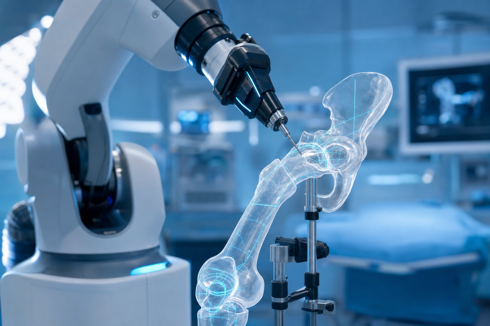
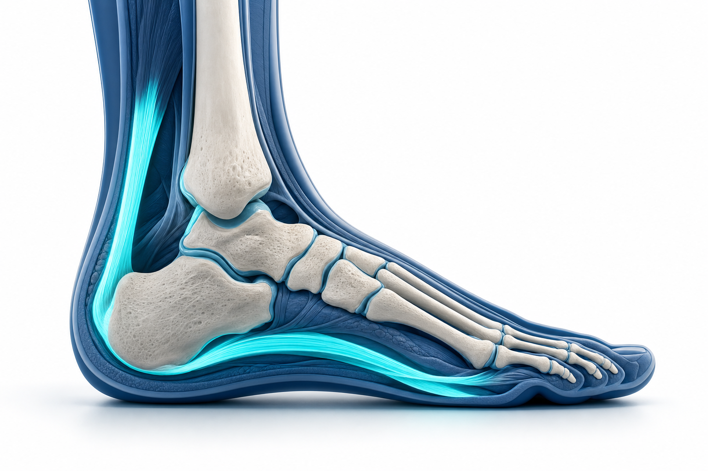
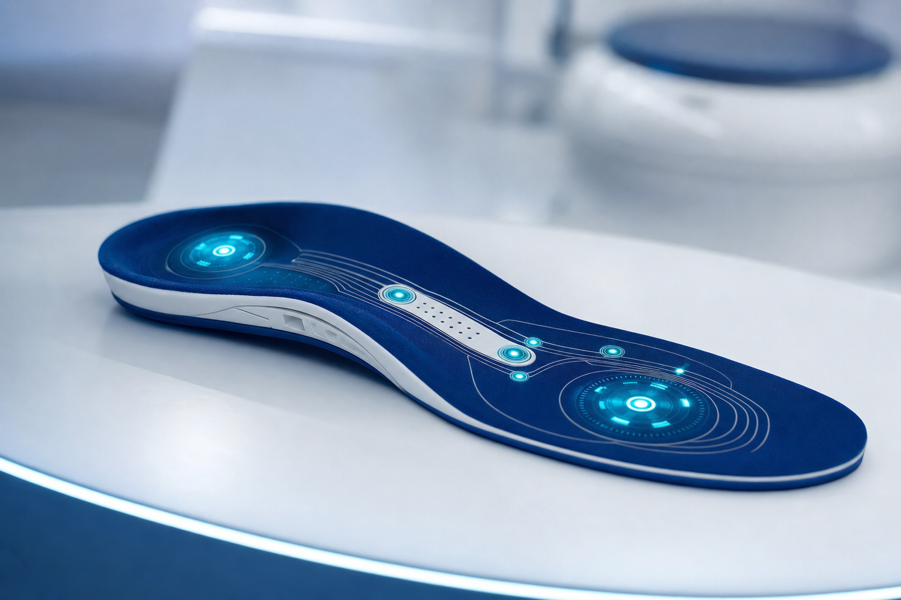

# שוק האורתופדיה בישראל: בין רובוטים שמנתחים מפרקים לכף רגל שמדממת

שוק האורתופדיה הישראלי הוא סיפור בעל שני פנים. מצד אחד, אקוסיסטם חדשנות שמייצר אקזיטים של מאות מיליוני דולרים וטכנולוגיות שמשנות את אופן ביצוע הניתוחים. מצד שני, מערכת בריאות ציבורית עם פערים חריפים בין מרכז לפריפריה — ומגיפת סוכרת שגובה את מחירה, לעיתים תרתי משמע, ברגליים. בין שני הקטבים האלה נמתח הסיפור המלא, וכף הרגל היא בדיוק הנקודה שבה הם נפגשים.

## גודל השוק והמגמות: זהירות עם המספרים

כאן נדרשת הבהרה חשובה. אין כיום נתון ציבורי מהימן שמבודד את "שוק האורתופדיה בישראל" בדולרים בלבד, ולכן יש לקרוא את המספרים הבאים בהקשרם הנכון — כשוק רחב יותר, ולא כתג מחיר של האורתופדיה הישראלית לבדה.

על פי הערכות, שוק המכשור הרפואי בישראל בכללותו צפוי לצמוח בקצב שנתי ממוצע של כ-6% בין 2025 ל-2030, ולהגיע לנפח של כ-4 מיליארד דולר עד סוף העשור. ברמה האזורית, שוק המכשור האורתופדי במזרח התיכון ואפריקה הוערך בכ-3.36 מיליארד דולר בשנת 2024, וצפוי להגיע לכ-5 מיליארד דולר עד 2033 — כשישראל היא אחת השחקניות המשמעותיות בו.

מבחינת היקפי פעילות בשטח, בישראל מבוצעים מדי שנה כ-3,000 עד 4,000 ניתוחי החלפת מפרק ירך. זהו נפח שמסביר מדוע כל שיפור בטכנולוגיה או בזמני ההמתנה נוגע בחיי אלפי אנשים בכל שנה.

## טכנולוגיה וניתוחים רובוטיים: כשהרובוט נכנס לחדר הניתוח

השינוי הבולט ביותר בתחום הוא כניסת הניתוחים הרובוטיים. מערכת MAKO של חברת Stryker, הרובוט הנפוץ בעולם לניתוחי החלפת ירך וברך, כבר פועלת בבתי חולים בישראל — בהם איכילוב הציבורי ורפאל הפרטי.

ההבדל מורגש כבר על שולחן הניתוחים. ד"ר ואדים בנקוביץ, שביצע ניתוח רובוטי כזה בישראל, מתאר קיצור דרמטי בזמן: כחצי שעה במקום שעה וחצי. הדיוק נמדד ב"חצאי מילימטרים או חצאי מעלות", החיתוך מינימלי, והפגיעה בשרירים, בגידים, בעצבים ובכלי הדם — קטנה יותר. "מחקרים קליניים הראו שניתוחים באמצעות רובוט מקצרים משמעותית את ההחלמה ומפחיתים סיבוכים", הוא אומר.

מאחורי הביצועים האלה עומדת מתודולוגיה שלמה. המערכת משלבת הדמיית CT תלת-ממדית לתכנון מוקדם של הניתוח, מתאימה את גודל המשתל ואת זווית ההשתלה בצורה אופטימלית, והזרוע הרובוטית עוצרת אוטומטית ברגע שמזוהה סטייה — כדי לא לפגוע ברקמות. לצד הרובוטיקה מתפתחות גם הטכניקות עצמן: מבחינים היום בין החלפת ברך חלקית, שבה מוחלף רק מדור פגוע אחד או שניים מתוך שלושה, לבין החלפה מלאה; ובהחלפות ירך צוברת תאוצה הגישה הקדמית, שמאפשרת חזרה מהירה יותר לשגרה. במקביל, ספורט-רפואה וארתרוסקופיה — הליך זעיר-פולשני לאבחון ולטיפול בפגיעות במפרקים — הפכו לתחום פעיל, עם יחידות ייעודיות בבתי החולים הציבוריים המרכזיים ושוק פרטי גדל של מנתחי ספורט ומרכזי שיקום.

## שחקנים ואקזיטים: החדשנות הישראלית על המפה העולמית

אם מחפשים את ההוכחה לכוחו של האקוסיסטם הישראלי, היא נמצאת בעסקת CartiHeal. החברה, שהוקמה בידי ניר אלטשולר, פיתחה את המשתל Agili-C לתיקון סחוס — טכנולוגיה שמושכת תאי גזע ממח העצם כדי לשקם סחוס ועצם פגועים. סמוך לאישור ה-FDA למוצר, רכשה אותה חברת Bioventus האמריקאית בעסקה שנעה בין 360 מיליון דולר מקדמה ועד 500 מיליון דולר בכפוף לאבני דרך.

האקזיט הזה תרגם לתשואות מרשימות עבור המשקיעים: אלרון רשמה כ-126 עד 129 מיליון דולר, קרן Accelmed כ-75 מיליון דולר — פי שבעה מהשקעתה — ו-Peregrine Ventures תשואה של כ-5,000%. בין המשקיעים בלטו גם aMoon, זרוע החדשנות של Johnson & Johnson, ו-Partech.

אבל CartiHeal היא רק קודקוד אחד. באוקטובר 2025 גייס הסטארט-אפ הישראלי CustoMED שישה מיליון דולר בסבב Seed, עבור פלטפורמת ענן שמשלבת בינה מלאכותית, אוטומציה והדפסת תלת-ממד. הרעיון: לייצר כלים כירורגיים ומשתלים אורתופדיים תוך דקות במקום שבועות, ישירות מתוך תוכנית הניתוח של המנתח. הרשימה ארוכה מזה — Ossio מפתחת טכנולוגיית קיבוע אורתופדי המבוססת על התחדשות עצם, Expanding Orthopedics מתמחה בהתקנים מתרחבים לעמוד שדרה, ולצדן פועלות חברות כמו Nurami Medical ו-OrthoSpace. את הקצה הקליני מובילים בתי חולים כמו איכילוב, שמיר (אסף הרופא), רבין ומאיר במגזר הציבורי, ורפאל והרצליה מדיקל סנטר במגזר הפרטי.

## כף הרגל והקרסול: התת-תחום שמחבר שלושה עולמות

תת-תחום כף הרגל והקרסול יושב על צומת מעניין — בין אורתופדיה, פודיאטריה ורפואת סוכרת. יחידות ייעודיות לכף רגל וקרסול פועלות בבתי חולים בישראל ומבצעות מגוון רחב של הליכים.

הנפוץ שבהם הוא תיקון האלוקס ולגוס — אותה "עצם בולטת" בבסיס הבוהן, המוכרת גם כבוניון, ואחד הניתוחים השכיחים ביותר בכף הרגל. לצידו מבוצעים תיקוני קרע בגיד אכילס, טיפולים בדורבן ובדלקת פאשיה (כאב עקב), בנוירומה ע"ש מורטון ובבוהן פטיש. בקרסול עצמו מבוצעים ארתרוסקופיה, קיבוע מפרק וקיבוע פנימי של שברים. כמו בשאר התחום, גם כאן ניכרת מגמה זעיר-פולשנית: ניתוחי האלוקס ולגוס מבוצעים כיום דרך חתכים זעירים של עד כשלושה מילימטרים, מה שמקצר החלמה ומפחית סיבוכים.

## כף רגל סוכרתית — הסיפור הישראלי

כאן הסיפור מחריף. כדי להבין אותו צריך להתחיל בהיקף: לפי דו"ח מצב הסוכרת של משרד הבריאות (מלב"ם) לשנת 2023, רשומים בישראל כ-696 אלף חולי סוכרת מגיל שנתיים ומעלה — כ-7.4% מהאוכלוסייה — וכרבע מהחולים כלל אינם מאובחנים. הסוכרת היא גורם התמותה הרביעי בישראל.

ומכאן הנתון שמהדהד בעוצמה: על פי דיווח של Ynet, המצטט את דו"ח מלב"ם, ישראל מדורגת במקום הראשון בקרב מדינות ה-OECD בשיעור קטיעות רגליים כתוצאה מסוכרת. ראוי לסייג — הנתון מובא כפי שדווח ומצוטט מהדו"ח, ולא כעובדה רשמית מאומתת באופן עצמאי. אך גם בזהירות הזו, התמונה ברורה: משהו במערכת הישראלית מאפשר לסוכרת להגיע עד כדי קטיעה בשכיחות גבוהה מהמקובל במדינות מפותחות. הפגיעות גבוהה במיוחד באוכלוסייה הערבית והבדואית, במעמדות סוציו-אקונומיים נמוכים ובפריפריה — אותם פערי מרכז/פריפריה שכבר עלו בהקשר זמני ההמתנה, רק שכאן המחיר נמדד באיברים.

הנתונים הקליניים מצטרפים לתמונה קשה. לפי נתוני קופת חולים מאוחדת, כ-15% ממטופלי הסוכרת מפתחים כף רגל סוכרתית, ובין 15% ל-22% יפתחו כיב סוכרתי במהלך חייהם — כשכשליש עד מחצית מהכיבים קשי-ריפוי. מחצית מחולי הסוכרת יפתחו נוירופתיה, נזק עצבי שגורם לכך שהמטופל פשוט אינו חש את הפצע המתפתח ברגלו. בקרב מי שכבר אובחן עם פצע איסכמי, שיעור התמותה מגיע ל-55% תוך חמש שנים. כף הרגל הסוכרתית מצוינת כסיבה המובילה לאשפוז בקרב חולי סוכרת — ובפרספקטיבה עולמית, המחלה פוגעת בכ-199 מיליון בני אדם ברחבי העולם.

### מבעיה לפתרון: כשהחדשנות פוגשת את הרגל

דווקא כאן נסגר מעגל הסיפור הישראלי. אל מול בעיה במימדים האלה צמחה חדשנות מקומית. Actics Medical, סטארט-אפ ישראלי, פיתחה מדרס חכם בשם Hybrid+ למניעת כיבי כף רגל סוכרתית. חיישנים מובנים מודדים בזמן אמת לחץ, טמפרטורה ותנועה של כף הרגל ומשדרים לאפליקציה, שמסוגלת להתריע על כיב פוטנציאלי שבועות לפני שהוא מופיע פיזית — בדיוק במקום שבו הנוירופתיה מונעת מהמטופל להרגיש. היתרון הייחודי הוא ההתאמה הדינמית: אם מזוהה לחץ-יתר באזור מסוים, האפליקציה מנחה את המטופל לשנות את צורת המדרס תוך דקות ולפזר מחדש את הלחץ. החיישנים אומתו במעבדת ההליכה והתנועה במרכז הרפואי הדסה בירושלים, שם נערכו גם ניסויים קליניים על מטופלים עם פתולוגיות שונות של כף הרגל.

יש כאן היגיון כלכלי ולא רק רפואי: העלות השנתית העולמית של סיבוכי כף רגל סוכרתית מוערכת בלמעלה מ-80 מיליארד דולר. זה בדיוק סוג הבעיה — יקרה, נפוצה ומדידה — שמושך גל חדשנות של מדרסים חכמים, שטיחי-חישה וחיישנים לבישים. המדרס המותאם אישית, שעד לא מזמן נחשב אביזר פסיבי, הופך לפלטפורמה טכנולוגית בצומת שבין פודיאטריה, אורתופדיה והנדסה.

## פודיאטריה ורגולציה: מקצוע שנבנה מבחוץ

מי מטפל בכל זה? בישראל, התשובה מורכבת. פודיאטריה — הטיפול הרפואי במחלות כף הרגל והקרסול, מדלקות גידים ועיוותים ועד פצעי כף רגל סוכרתית — היא מקצוע שאין בישראל מוסד לימודי המכשיר אליו. העוסקים בו למדו בחו"ל, בארה"ב, אנגליה, צרפת, ספרד או דרום-אפריקה, ועברו בחינות רישוי של משרד הבריאות.

הרגולציה הדביקה את הקצב בהדרגה. ביוני 2018 נכנסו לתוקף תקנות שהסדירו את רישוי מקצועות הפודיאטריה והפודיאטריה הכירורגית: פודיאטר מורשה רשאי לבצע ניתוחים קלים, כמו טיפול בציפורן חודרנית, ואילו פודיאטר כירורגי מוסמך לניתוחים מורכבים יותר בעצמות כף הרגל והקרסול, ואף לרשום תרופות. בפברואר 2024 השלימה הכנסת חוק נוסף, להסדרת מקצוע הפודולוגים — מטפלי כף רגל במקצוע פרא-רפואי, העוסקים בטיפול חיצוני ולא-פולשני, בזיהוי מוקדם של מחלות כף רגל, בהתאמת הנעלה ומדרסים ובהפניה למומחים. בצד הציבורי פועלים מרכזים פודיאטריים בבתי חולים, כמו זה שבמרכז הרפואי מאיר.

## זמני המתנה: הפער שעולה איברים

מעל כל אלה מרחפת שאלת הנגישות. על בסיס תקציר מדיניות של מרכז טאוב — ובניסוח זהיר, שכן מדובר בתמונת מצב שעשויה להשתנות — הפערים בין מרכז לפריפריה בזמני ההמתנה לניתוחים אורתופדיים חדים. בבית חולים בחיפה ההמתנה לניתוח החלפת ירך עשויה לעמוד על כשלושה שבועות בממוצע, בעוד בבית חולים בדרום אותו ניתוח עלול להמתין כשנה. בירושלים זמני ההמתנה קצרים בכ-28% מהממוצע הארצי; בדרום הם הארוכים בארץ, גבוהים בכ-44% מהממוצע. הסיבה העיקרית אינה רפואית אלא משאבית: מחסור בתשתיות בפריפריה, ובראשם מספר מיטות אשפוז מוגבל.

זה לא פער טכני בלבד. בניתוחים אורתופדיים, חלון הזמן לשיקום נסגר בהדרגה ככל שההמתנה מתארכת — וכשמדובר בכף רגל סוכרתית, עיכוב בטיפול עלול להיות ההבדל בין החלמה לקטיעה. רפורמה שיישם האוצר ביוני 2024, שנועדה למנוע כפל ביטוחי והעבירה לקוחות מפוליסות ניתוחים "מהשקל הראשון" לפוליסות שב"ן משלימות, עוררה חשש שדווקא תאריך את התורים הציבוריים — לפי ההערכות, ממתינים לניתוחי החלפת מפרק עלולים למצוא את עצמם מחכים בין חצי שנה לשנה וחצי. כך נבנית מערכת דו-פנית: מי שיכול, פונה למסלול הפרטי דרך שר"פ וביטוח משלים; מי שלא, ממתין.

## סיכום: שני קצוות של אותו גוף

שוק האורתופדיה הישראלי הוא תרגיל בהחזקת שני קצוות בו-זמנית. בקצה אחד, אקזיט של חצי מיליארד דולר, רובוטים שמנתחים בדיוק של חצי מעלה, ומדרס חכם שמתריע על פצע שבועות מראש. בקצה השני, מקום ראשון לא מחמיא ב-OECD בקטיעות רגליים עקב סוכרת, ופערי המתנה שבהם הגאוגרפיה קובעת מי מקבל טיפול בזמן. כף הרגל, דווקא, היא המקום שבו שני הקצוות נפגשים: היא מסכמת את הבעיה — מערכת שמתקשה להגיע לכולם בזמן — ואת ההבטחה — חדשנות ישראלית שיודעת לפתור בעיות שכל העולם מתמודד איתן. השאלה הפתוחה היא לא אם ישראל יודעת לייצר את הפתרונות, אלא אם היא תצליח להביא אותם בזמן עד הקצה — עד כף הרגל של החולה בפריפריה.
