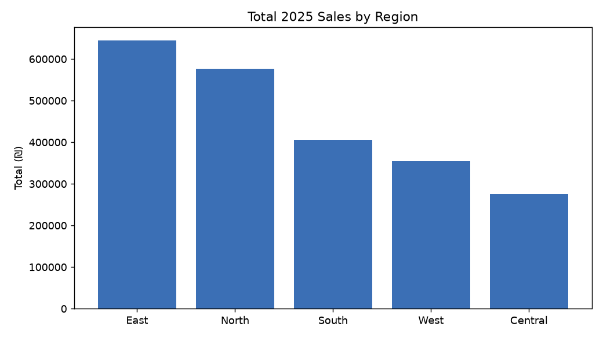
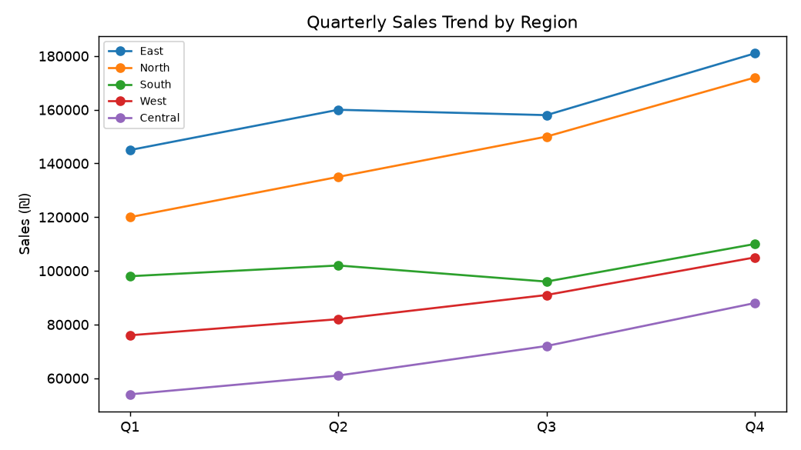

# דוח ניתוח — מכירות לפי אזור (2025)

**מקור הנתונים:** `Planning_Data/2026-06-13-regional-sales.xlsx` (גיליון `Sales2025`)

## תובנות עיקריות
- **סך מכירות כולל:** ₪2,256,000
- **האזור המוביל:** East עם ₪644,000 סך הכל.
- **הצמיחה המהירה ביותר (Q1→Q4):** Central — 63.0%.

## טבלת סיכום
| אזור | Q1 | Q2 | Q3 | Q4 | סך הכל | צמיחה % |
|------|----|----|----|----|--------|---------|
| East | 145,000 | 160,000 | 158,000 | 181,000 | 644,000 | 24.8 |
| North | 120,000 | 135,000 | 150,000 | 172,000 | 577,000 | 43.3 |
| South | 98,000 | 102,000 | 96,000 | 110,000 | 406,000 | 12.2 |
| West | 76,000 | 82,000 | 91,000 | 105,000 | 354,000 | 38.2 |
| Central | 54,000 | 61,000 | 72,000 | 88,000 | 275,000 | 63.0 |

## גרפים

> כל המספרים חושבו ישירות מעמודות Q1–Q4 שבקובץ הקלט. אין נתונים חסרים.
